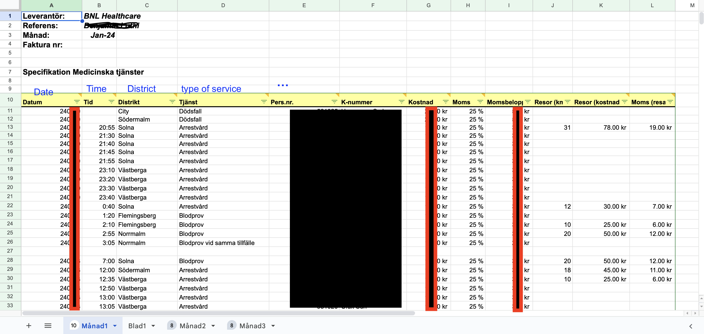
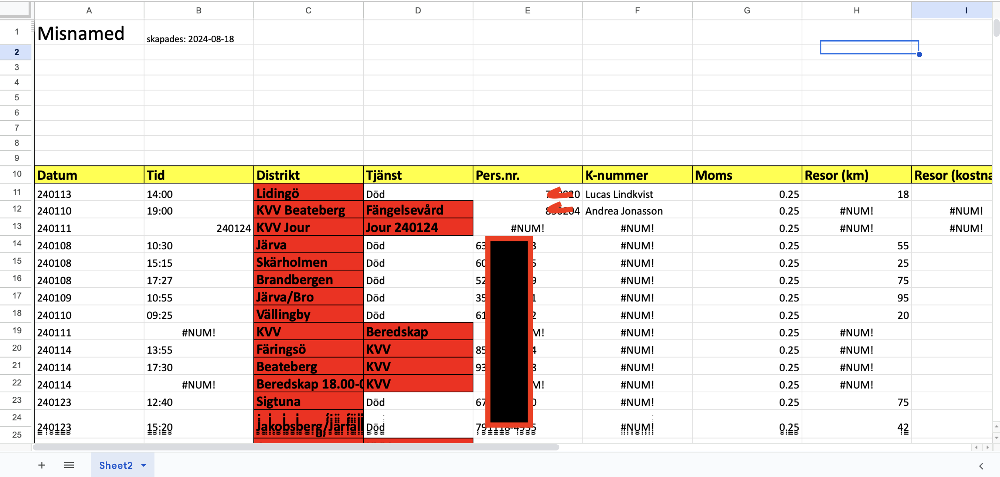
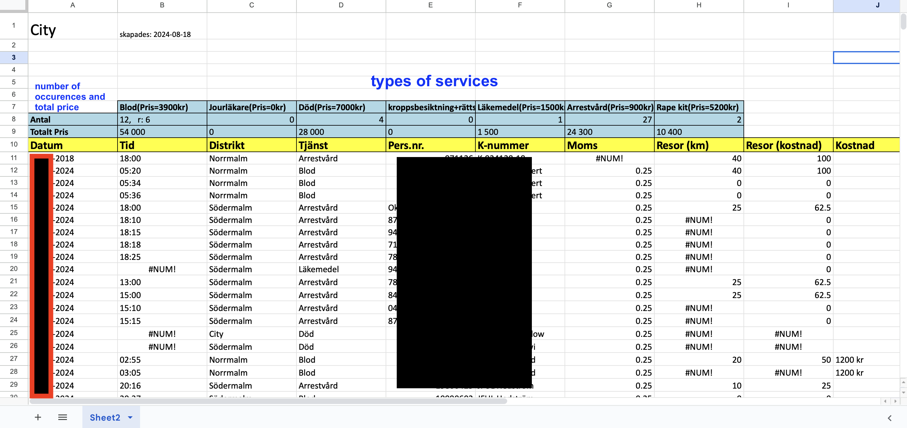

# invoice_handler
- Invoice handler for "stockholm akut-läkargrupp" Stockholm emergency physicians. The program combines and sorts invoices in excel format using python

This is a program used to compile a folder with 7 different output-files (.xlsx), from an input-folder with an arbitrary amount of input files (.xls/xlsx). 

## Input data
the input to the program is a folder with an arbitrary amount of files. The files are in .xls or .xlsx format. Each Doctor sends in their work for the month in an excel file. The data is structured in the following way:

Every row represents a patient visit. It is these patient visits that are to be sorted into the 7 output-files, depending on where in stockholm they have occured. 

### Example of one input-file from the input folder:

## Output data

5 of the output-files are associated with 5 different districts in stockholm. Of the 2 remaining output-files, one is data associated with `misnamed rows`, and the last one is filled with `dropped rows`.

### Misnamed rows (output)
`misnamed rows` are rows occurr when the input data is not structured as expected. This could be due to a misspelling of a district/type-of-service name, or a district/type-of-service name that is not recognized. Or invalid date/time formats.

### Dropped rows (output)
`dropped rows` are rows that dont contain a district or dont contain a typ-of-service. These rows are not treated by the program, but saved in the output file `dropped rows`, for manual inspection if needed.

### district output-files
The five Districts are: (Norrtälje, Södertälje, Syd, City, Nord) each district contain several places in Stockholm. The places are:

- `Syd`: Flemingsberg, Nacka, flempan, söderort, syd, Stockholm syd and Västberga.

- `Nord`: Sollentuna, Solna, norrort, and Tegen.

- `City`: Södermalm, Östermalm, Norrmalm
- `Södertälje`: Södertälje
- `Norrtälje`: Norrtälje

Different people might have put in the data in different ways, so the program is designed to convert the different ways of writing the input data to one way.
  
### Example of output-file related to City:

## How the program works
The program can be seen as a function (F) that takes the input-folder of files (to be sorted) and outputs a folder with 7 output sorted files.

	folder_input = [file_1, file_2, ..., file_N]
	F(input) = application
	folder_output = [syd, nord, city, södertälje, norrtälje, misnamed, kvv]
	
	F(input_folder) = folder_ouput

